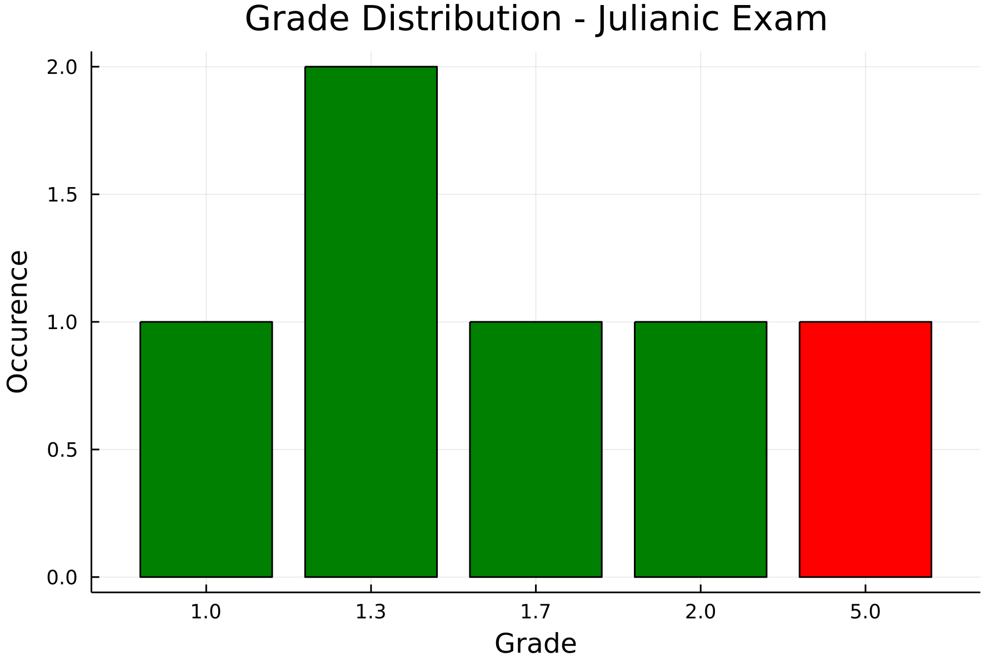

# Exam.jl

Counting points and grades with Julia

| **Build Status**                          | **Code Coverage**               |
|:-----------------------------------------:|:-------------------------------:|
| [![][CI-img]][CI-url] | [![][codecov-img]][codecov-url] |


## Features
A simple package which add Points together, calculates the grades, exports a histogram and might apply a bonus to the grade.


## Example
We create a `simple_exam.yml`
```yaml
title: Julianic Exam
date: 2022-02-25

bonus: 
  available: true
  system: increment_grade

tasks:
  - id: 1
    max_points: 5

  - id: 2
    max_points: 2

grades:
  - grade: 1.0
    passed: true
    min_points: 7

  - grade: 1.3
    passed: true
    min_points: 6
  
  - grade: 1.7
    passed: true
    min_points: 5.5
  
  - grade: 2.0
    passed: true
    min_points: 3.5
  
  - grade: 5.0
    passed: false 
    min_points: 0
```

Second, a simple `simple_results.csv`:
```csv
name,id,bonus,1,2
Felix,1,false,3,2.5
Julian,2,true,2.5,3
Julia,3,false,5,1
Programmus,4,false,5,2
Nooobus,5,false,0,0.0
Noobus,6,false,0,3.5
```

Finally, call:
```julia
julia> using Exam

julia> evaluate("test/simple_results.csv", "test/simple_exam.yml")
6×7 DataFrame
 Row │ name        id     bonus  1        2        total_points  grade
     │ String15    Int64  Bool   Float64  Float64  Float64       Any
─────┼─────────────────────────────────────────────────────────────────
   1 │ Felix           1  false      3.0      2.5           5.5  1.7
   2 │ Julian          2   true      2.5      3.0           5.5  1.3
   3 │ Julia           3  false      5.0      1.0           6.0  1.3
   4 │ Programmus      4  false      5.0      2.0           7.0  1.0
   5 │ Nooobus         5  false      0.0      0.0           0.0  5.0
   6 │ Noobus          6  false      0.0      3.5           3.5  2.0
```

Further, the following histogram is generated:



[CI-img]: https://github.com/roflmaostc/Exam.jl/actions/workflows/ci.yml/badge.svg
[CI-url]: https://github.com/roflmaostc/Exam.jl/actions/workflows/ci.yml

[codecov-img]: https://codecov.io/gh/roflmaostc/Exam.jl/branch/main/graph/badge.svg?token=y4mLYZ2PGy
[codecov-url]: https://codecov.io/gh/roflmaostc/Exam.jl

